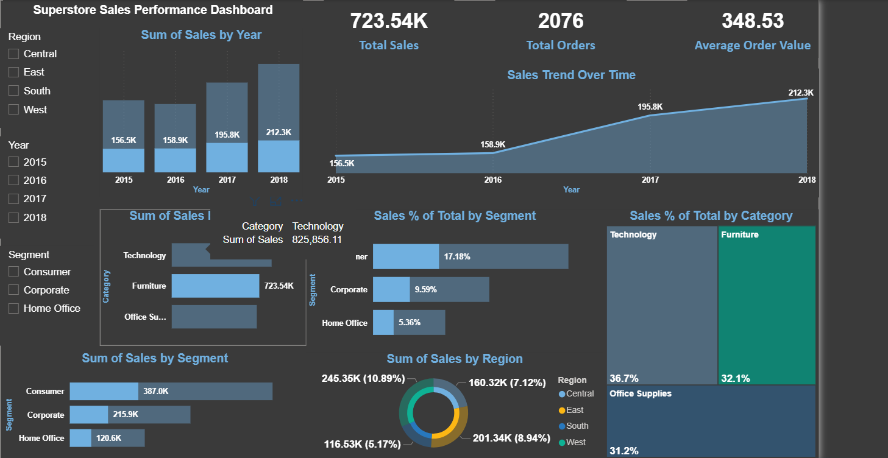

# Superstore Sales Analysis

This project analyzes Superstore sales data using SQL Server and Power BI.

## Tools
- SQL Server
- Power BI
- Python

## Analysis
- Sales trends over time
- Category and segment analysis
- Regional sales performance
## Dashboard Preview

